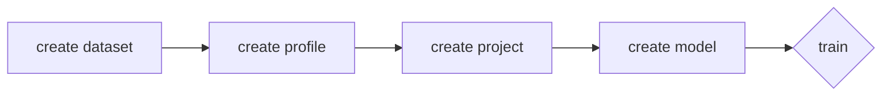

# What is SimpleClai?

SimpleCommandLineAI, SimpleClai or sclai for short aims to automate the machine learning workflow. This is the command line version of SimpleAi (comming soon). Currently it is focused on easy setup of the [TensorFlow Object Detection API](https://github.com/tensorflow/models/tree/master/research/object_detection#tensorflow-object-detection-api) and training of its models respectively.
> **Note:** SimpleClai currently only supports debain based linux distributions.

> **Furthermore:** SimpleClai is still not finished and currently not working.


# Installation
**Download** the .deb file from the latest release in the [releases](https://github.com/sertschgi/simpleClai/releases) page. 

- Option 1: 
	1. **Click** on the downloaded file. 
	2. **Open** with your installation App. *(Software Center in Ubuntu)*
	3. **Click** *install*.

- Option 2: 
	1. **Open** a terminal.
	2. `cd Downloads`
	3. `sudo dpkg -i sclai.deb`

# Usage
> **Note:** You might want to read [Workflow](#workflow) first.

    sclai [options] command

Always available **options** are:
| | |
|--|--|
| `-h`, `--help` | `Displays help on commandline options.` |
| `-v`, `--version` | `Displays version information.` |

## Commands

### - create
    sclai create [options] command

> **Note:** All data created by the user is usually saved in `~/.sclai`.  [More](#data-saving) about saved data.

#### Available commands are:
***
#### - dataset

    sclai create dataset [options]

Available **options** are:
| | | |
|--|--|--|
| `-n`, `--name` | `Specify the name of your dataset.` | *required* |
| `-l`, `--labels` | `Specify the path of your labelmap.pbtxt` | *required* |
| `-a`, `--labels_path` | `Specify the label path` | *required* |
| `-m`, `--images_path` | `Specify the images path` | *required* |

Example:

    sclai create dataset -n mydataset -l path/to/my/labelmap.pbtxt -a path/to/my/labels -m path/to/my/images 

> **Note:** Supported label formats: xml, csv. Xml files need to be provided for each image with the same name. When using a csv file only one file is supported. [More](#labeling) about labeling.

***
#### - profile

    sclai create profile [options]
 
Available **options** are:
| | | |
|--|--|--|
| `-n`, `--name` | `Specify the name of your profile.` | *required* |
| `-f`, `--framework` | `Specify the framework you want to use.` | *required* |
| `-s`, `--scope` | `Specify which field of machine learning you want to use.` | *required* |

Example:

    sclai create profile -n myprofile -f tensorflow -s object_detection 

> **Note:** *Framework* and *scope* are usually defined in `/etc/sclai/config/frameworks.json`. This file contains all setup information. You can also [add your own custom framework](#custom-frameworks) or adjust the existing.

***
#### - project

    sclai create project [options]
 
Available **options** are:

| | | |
|--|--|--|
| `-n`, `--name` | `Specify the name of your project.` | *required* |
| `-p`, `--profile` | `Specify the profile you want to use.` | *required* |
| `-d`, `--dataset` | `Specify the dataset you want to use.` | *required* |

Example:

    sclai create project -n myproject -p myprofile -d mydataset

***
#### - model

    sclai create model [options]
 
Available **options** are:
| | | |
|--|--|--|
| `-n`, `--name` | `Specify the name of your model.` | *required* |
| `-p`, `--project` | `Specify the project you want to use.` | *required* |
| `-m`, `--model` | `Specify the model you want to use.` | *required* |

Example:

    sclai create model -n mymodel -p myproject -m "CenterNet MobileNetV2 FPN"

***
### - train
    sclai train [options]
Available **options** are:
| | | |
|--|--|--|
| `-m`, `--model`  | `Specify the name of the model.` | *required* |
| `-p`, `--project` | `Specify the project.` | *required* |

Example:

    sclai train -p myproject -m mymodel

***
### - list
    sclai train [options]
Available **options** are:
| | | |
|--|--|--|
| `-d`, `--datasets` | `List the datasets.` |
| `-r`, `--profiles` | `List the profiles.` |
| `-p`, `--projects` | `List the projects.` | *default* |
| `-f`, `--frameworks` | `List the frameworks.` |

Example:

    sclai train -p myproject -m mymodel

# Workflow

A typical workflow could look like this:


> **Note:** You might want to take a look at [Labeling](#labeling).

**First** create a **dataset** from your labeled data. **Then** create a **profile**. This will install all apps needed for your training and set up a [conda](https://docs.conda.io/en/latest/) virtual environment to not interfere with your system. Both dataset and profile can of course be used for multiple projects. The **third** step is to create a **project** that contains your models. Now you can choose your **model** you want to use. There can also be multiple of the same type of model. **Finally** you can select a model and start **training**!

# Labeling
### Formats
There are many labeling formats. Unfortunately SimpleClai isn't finished yet and currently only supports xml or csv as formats for object detection. As there will be added more functionallity many more labeling formats will be also added.

Currently supported formats:
| format | explanation | 
| - | - | 
| xml | for every image there must be one xml file with the same name 
| csv | for all images there is one file that contains image name and label-data

> **Tip:** For those who are labeling themselves: Make sure your annotator supports these formats and you won't need to wory about them anymore. 

Sample xml file: 

    <annotation>
    	<filename>IMG_2385.JPG</filename>
    	<path>/my/images/IMG_2385.JPG</path>
    	<size>
    		<width>378</width>
    		<height>504</height>
    		<depth>3</depth>
    	</size>
    	<segmented>0</segmented>
    	<object>
    		<name>shirt</name>
    		<pose>Unspecified</pose>
    		<truncated>0</truncated>
    		<difficult>0</difficult>
    		<bndbox>
    			<xmin>92</xmin>
    			<ymin>183</ymin>
    			<xmax>223</xmax>
    			<ymax>348</ymax>
    		</bndbox>
    	</object>
    </annotation>

Sample csv file:

| filename | width | height | class | xmin | ymin | xmax | ymax |
| - | - | - | - | - | - | - | - |
| cam_image1 | jpg | 480 | 270 | queen | 173 | 24 | 260 | 137
| cam_image1 | jpg | 480 | 270 | queen | 165 | 135 | 253 | 251
| cam_image1 | jpg | 480 | 270 | ten | 255 | 96 | 337 | 208
| cam_image10 | jpg | 960 | 540 | ten | 501 | 116 | 700 | 353

***
### Labelmap
ln order to [create a dataset](#--dataset) a labelmap is currently also required as it is currently not automatically gererated from the provided labels.

A labelmap.pbtxt could look like this:

```
item {
  id: 1
  name: 'basketball'
}

item {
  id: 2
  name: 'shirt'
}

item {
  id: 3
  name: 'shoe'
}
```

# Intern
## Data Saving
The grid lists all the default paths:
| | Path | Note |
| - | - | - |
| **app**: |
| exec |  `/usr/bin/sclai` 
| apps | `~/.sclai/profiles/apps` | *user specific*
|**config**: |
| frameworks | `/etc/sclai/config/frameworks.json`
| datasets | `~/.sclai/config/datasets.json` | *user specific*
| profiles | `~/.sclai/config/profiles.json` | *user specific*
| projects | `~/.sclai/config/projects.json` | *user specific*
| **scripts** |
| all | `~/.sclai/scripts/*`
| **other**: |
| data | `~/.sclai` | *user specific*, *changeable*
| datasets | `~/.sclai/datasets` | *user specific*, *changeable*
| profiles | `~/.sclai/profiles` | *user specific*, *changeable*
| projects | `~/.sclai/profiles/projects` | *user specific*
| models | `~/.sclai/profiles/projects/models` | *user specific*

> **Note**: The model configuration is saved in `profiles.json`

The **data**, **datasets** and **profiles** path are **changeable**. To change them just **set** the environment variables in your `~/bashrc` and `~/bash_profile` respectively. 

Environment variables:
| | | 
| - | - | 
| data | `$DATA_PATH` 
| datasets | `$DATASET_PATH`
| profiles | `$PROFILE_PATH` 

Example:

    echo "export PROFILE_PATH=/path/to/profiles" >> ~/.bashrc && echo "export PROFILE_PATH=/path/to/profiles" >> ~/.bash_profile

## Custom Frameworks
If you want to modify existing or add a framework that isn't already set up, you can do that fairly easily.

**First** open the frameworks.json file normally located in `/etc/sclai/config` (-> [Data Saving](#data-saving)). 

When creating a framework you will need to add the name of the framework like this:

    {
        ...
        "myFramework" : {}
    }

You will need a scope too:

    {
        ...
        "myFramework" : {
	        "myScope" : {}
        }
    }

**Next** you specify where the python interpreter is located. When doing this there are a few handy variables available:
| | | |
| - | - | - |
| `$NAME` | the name of the profile, project or model created
| `$DATA_PATH` | the folder that contains the config and scripts directory. [More](#data-saving)
| `$PROFILE_PATH`  | the path were the profile stored | *not available on model and training_script*
| `$PROJECT_PATH`  | the path were the profile stored | *only available on project install_script*
| `$MODEL_PATH`  | the path were the profile stored | *only available on model install_script and training_script*

> **Tip:** use the python interpreter of a virtual environment

We are going to place our environment in the profile path:


    {
        ...
        "myFramework" : {
	        "myScope" : {
		        "python_path" : "$PROFILE_PATH/myenv$NAME/bin/python"
	        }
        }
    }

**Then** add a training script.


    {
        ...
        "myFramework" : {
	        "myScope" : {
		        "python_path" : "$PROFILE_PATH/myenv$NAME/bin/python"
		        "training_script" : "$DATA_PATH/scripts/mycustomtrainingscript.sh $NAME"
	        }
        }
    }

**Afterwards** we add the install scripts for profile and project:


    {
        ...
        "myFramework" : {
	        "myScope" : {
		        "python_path" : "$PROFILE_PATH/myenv$NAME/bin/python"
		        "training_script" : "$DATA_PATH/scripts/mycustomtrainingscript.sh $NAME $MODEL_PATH"
		        "profile" : {
			        "install_script" : "$DATA_PATH/scripts/myprofileinstallscript.sh $NAME $PROFILE_PATH"
		        }
		        "project" : {
			        "install_script" : "$DATA_PATH/scripts/myprojectinstallscript.sh $NAME $PROJECT_PATH"
		        }
	        }
        }
    }

**Finally** we add a Model with install_script:


    {
        ...
        "myFramework" : {
	        "myScope" : {
		        "python_path" : "$PROFILE_PATH/myenv$NAME/bin/python"
		        "training_script" : "$DATA_PATH/scripts/mycustomtrainingscript.sh $NAME $MODEL_PATH"
		        "profile" : {
			        "install_script" : "$DATA_PATH/scripts/myprofileinstallscript.sh $NAME $PROFILE_PATH"
		        }
		        "project" : {
			        "install_script" : "$DATA_PATH/scripts/myprojectinstallscript.sh $NAME $PROJECT_PATH"
		        }
		        "models" : {
			        "myCustomModel" : {
				        "install_script" : "$DATA_PATH/scripts/mymodelinstaller.sh $NAME myCustomModel
			        }
		        }
	        }
        }
    }
